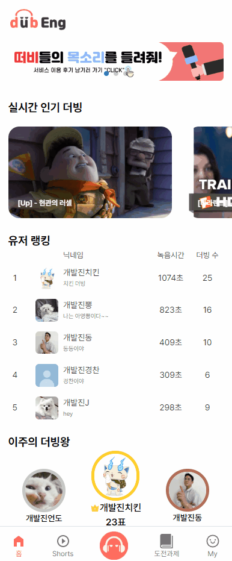
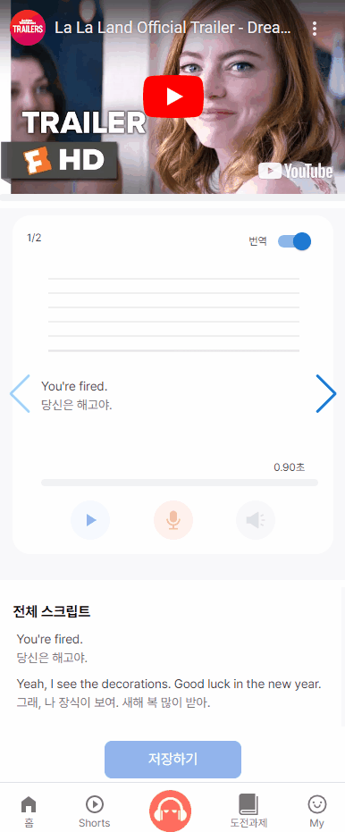
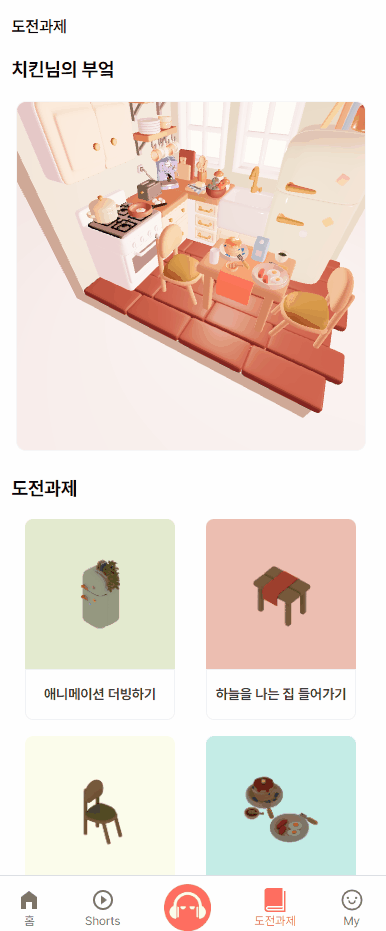
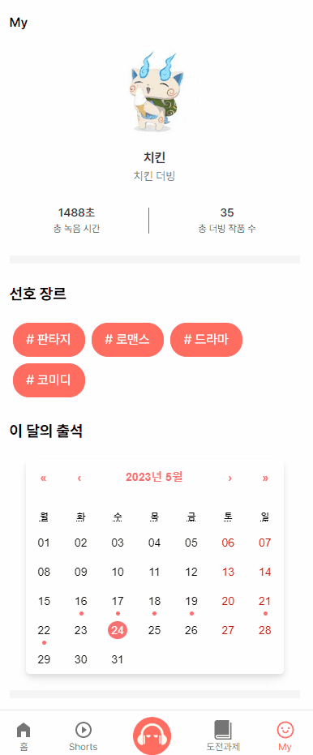
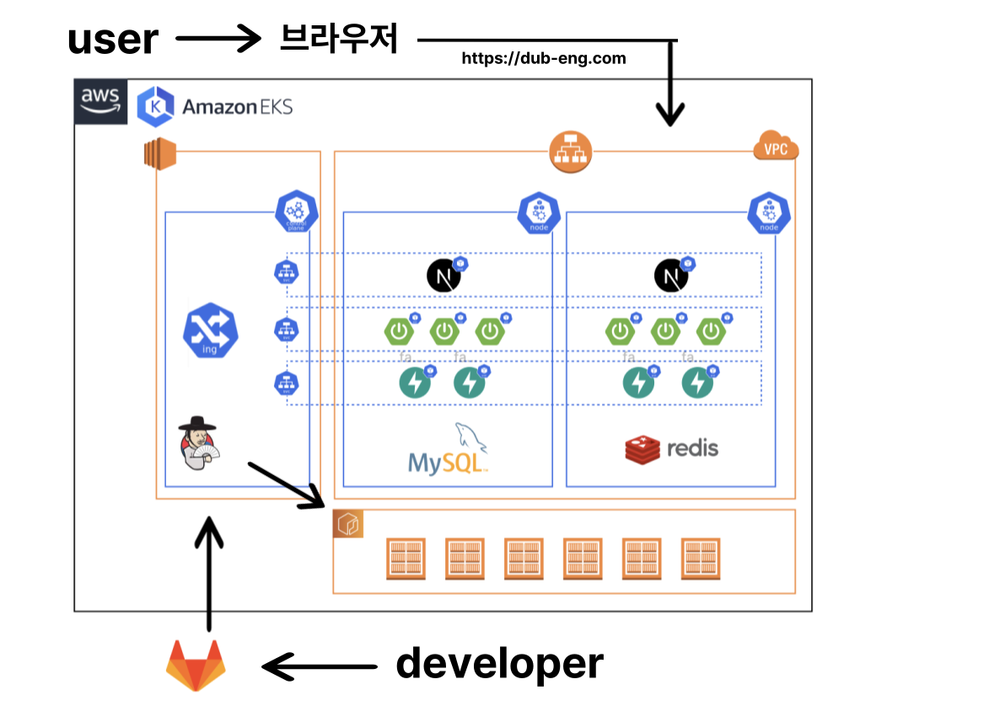
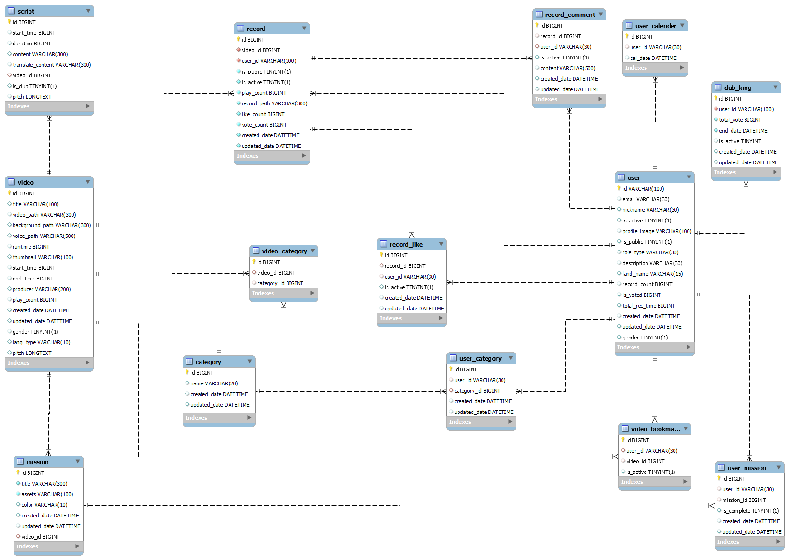
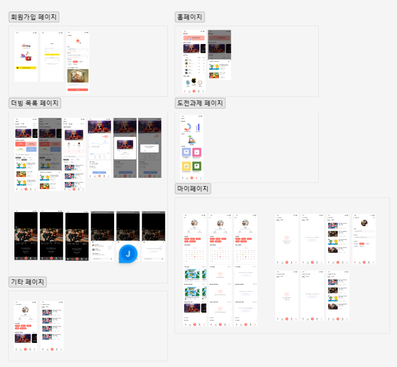
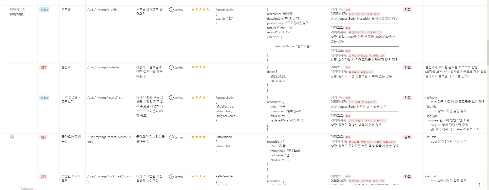

# 🎧 **Dubeng** 🎧

---

**영어로 연기하며 스피킹을 배우는 서비스**


</br>

## 😀 프로젝트 소개 😀

---

✏ **프로젝트명**

- **dubEng [덥잉]**


🖥 **서비스 주소**

[DubEng](https://dub-eng.com/)

💖 **서비스 소개**

> **영어로 더빙하며 스피킹을 배우는 서비스**
> 
> 
> **Practice makes Perfect**
> 

- **따라읽기만 하던 영어는 이제 그만! ✋**
    
    영어 회화 실력을 늘리려면 매일 조금씩 꾸준히 영어로 말하는게 중요합니다. 기존의 영어 학습법은 단순히 단어 외우기, 문법 공부등 지루한 공부를 통해 배웁니다.
    
    덥잉 서비스는 더빙을 해봄으로써 재미있게 영어의 강세 습득 및 스크립트를 외우면서 자연스럽게 회화 스킬을 얻을 수 있습니다. 
    
    아직도 기계적으로 문제를 풀듯이 영어를 공부하고 계신가요? 소통을 위한 언어인 영어, DubEng과 함께 이제는 재미있게 배워보세요! 
    

- **다양한 콘텐츠 둘러보기 👀**
    
    관리자 페이지에서 직접 검수하기 때문에 양질의 영상 컨텐츠를 볼 수 있습니다. 
    
    다양한 카테고리와 검색을 통해 원하는 영상을 쉽게 검색할 수 있습니다.
    
    상황별 더빙하기를 통해 원하는 상황에서의 콘텐츠를 살펴보세요.
    
    ** 만약 내가 원하는 컨텐츠가 어떤건지 모르겠다면 더빙의 추천 알고리즘을 통해 원하는 콘텐츠를 추천 받아보세요. **
    
- **다양한 더빙작품 둘러보기 👀**
    
    오늘의 더빙왕은 누구에게 투표할 것인가요? 하루에 4번 더 잘하는 떠비들에게 투표할 수 있습니다. 
    
    매주 더빙왕이 업데이트 되기 때문에 여러분도 이주의 더빙왕에 등극할 수 있습니다.
    
- **더빙하기를 더 정확하게 📈**
    
    STT와 피치그래프를 통해서 내 발음이 정확한지 살펴볼 수 있습니다.
    
    더빙 완료 후 영상과 함께 미리보기를 재생하여 완성된 더빙을 미리 볼 수 있습니다.
    
    영화나 드라마속 다양한 배우들과 함께 대사를 주고 받으면서 여러분도 스타가 되어보세요.
    

👤 **서비스 대상**

- 단순히 읽기, 듣기, 쓰기 외에 **진짜 스피킹을 위한 영어**를 공부하고 싶으신 분
- **좋아하는 컨텐츠**를 즐기면서 자연스럽게 영어도 학습하고 싶으신 분
- 영어 시험 성적은 높지만 **스피킹 앞에서 한없이 작아지는 분**
- DubEng에서 좋아하는 컨텐츠의 주인공이 되어, 직접 **내 목소리를 녹음한 더빙 작품**을 만들어보세요!

☝🏻 **주요 기능**

- 홈
- 숏츠
- 목록
- 도전과제
- 마이페이지
- 더빙하기

🎠 **배포 환경**

- URL : [https://dub-eng.com/](https://dub-eng.com/)
- 포팅 메뉴얼

🗓 **진행 일정**

- 2023.04.10 ~ 2023.05.31 (총 6주)

🚩 **프로젝트 요약**

| Application | Language | Framework |
| --- | --- | --- |
| ✅ Desktop Web | ✅ JavaScript | 🔲 Vue.js |
| ✅ Mobile Web | ✅ TypeScript | ✅ React |
| 🔲 Responsive Web | 🔲 C/C++ | 🔲 Angular |
| 🔲 Android App | 🔲 C# | 🔲 Node.js |
| 🔲 iOS App | ✅ Python | ✅ Flask/FastAPI |
| 🔲 Desktop App | ✅ Java | ✅ Spring/Springboot |

👨‍👧‍👧 **팀 소개 - 🙋‍♀️도비🙋‍♂️**

| [김아영](https://github.com/joen00) | [김도언](https://github.com/eondo) | [김동률](https://github.com/lancelot1672) | [김지희](https://github.com/4priltwntsx) | [백자민](https://github.com/sdflksjf2683) | [최정온](https://github.com/choijeongon) | [임경찬](https://github.com/rudcks5562) |
| --- | --- | --- | --- | --- | --- | --- |
|  |  |  |  |  |  |  |

## 📢 주요 기능 📢

---

## 홈

**1️⃣ 실시간 인기 더빙**

- 조회수와 좋아요순으로 정렬된 더빙 작품

**2️⃣ 유저 랭킹**

- 녹음시간과 더빙 수로 정렬된 유저 랭킹 Top 5

**3️⃣ 이주의 더빙왕**

- 이번주 투표수가 가장 많은 유저 랭킹 Top 3



## 목록

- 영어 콘텐츠와 한국어 콘텐츠를 선택해서 볼 수 있습니다.
- 다양한 카테고리와 제목 검색을 통해 원하는 작품을 검색해보세요.

**1️⃣ 더빙 콘텐츠**

- 유저의 개인 맞춤 추천 콘텐츠를 추천받을 수 있습니다.
    - 카테고리, 제작사, 성별을 기반으로 가중치를 다르게 주어 원하는 콘텐츠를 추천받을 수 있습니다.
- “상황별로 더빙해봐요” 를 통해 주어진 상황에서의 더빙 콘텐츠들를 보여줍니다.

**2️⃣ 더빙 작품**

- 하루에 4번 더빙왕을 투표할 수 있습니다. 하나의 작품에 대해 2명의 유저가 경쟁하여 더빙왕이 될 수 있습니다.


## 숏츠

- 더빙된 작품을 숏츠 형태로 살펴보기


## 더빙하기

**1️⃣ 구간별 스크립트 더빙**

- 해당 구간을 재생하고 더빙할 수 있습니다.
- 피치 그래프와 STT를 통해 정확하게 더빙을 하고 있는지 볼 수 있습니다.
- 번역 토글을 통해 번역을 가릴 수 있습니다.

**2️⃣ 전체 스크립트**

- 해당 콘텐츠의 모든 스크립트를 볼 수 있습니다.

**3️⃣ 저장하기**

- 저장 후 미리 보기를 통해 잘 더빙이 됐는지 확인할 수 있습니다. 완벽하게 더빙이 됐으면 올려주세요.



## 도전과제

- 도전과제 페이지에 가면 완성해야 할 “나만의 부엌”과 “완료한 도전과제 리스트”를 확인할 수 있습니다.
- 특정 콘텐츠를 더빙하면 해당 콘텐츠에 매핑된 도전과제를 완료할 수 있습니다.
- 도전과제를 하나씩 완료하면 alert창과 함께 각 도전과제에 매핑된 에셋이 잠금 해제되고, 해제된 에셋은 나만의 부엌에 활성화됩니다.
- 도전과제를 모두 완료하면 나만의 부엌이 완성됩니다.




## 마이페이지

**1️⃣ 프로필 정보**

- 프로필 사진과 닉네임, 한 줄 소개, 총 녹음 시간, 총 더빙 작품 수 등 기본 프로필 정보를 확인할 수 있습니다.

**2️⃣ 선호 장르 및 출석 현황**

- 회원가입 시 선택했던 카테고리 장르를 확인할 수 있습니다.
- 캘린더에 출석 현황이 표시됩니다.

**3️⃣ 더빙/컨텐츠 목록**

- 나의 더빙 목록
    - 유저가 더빙한 더빙 목록을 모두 확인할 수 있습니다.
    - 해당 더빙 작품을 클릭하면 상세 페이지로 이동하여 작품을 재생해볼 수 있습니다.
    - 다른 사람이 내 프로필을 볼 때는 “공개” 설정한 더빙 작품만 보이게 됩니다.
    - 마이페이지에서는 상위 다섯개의 더빙 작품을 확인할 수 있고, 상세보기로 이동하면 영어/한국어 별로 나눠 확인할 수 있습니다.
- 좋아요한 더빙 목록
    - 유저가 좋아요를 누른 더빙 작품 목록을 확인할 수 있습니다.
    - 해당 더빙 작품을 클릭하면 상세 페이지로 이동하여 작품을 재생해볼 수 있습니다.
    - 마이페이지에서는 상위 다섯개의 더빙 작품을 확인할 수 있고, 상세보기로 이동하면 영어/한국어 별로 나눠 확인할 수 있습니다.
- 저장한 콘텐츠 목록
    - 유저가 북마크한 콘텐츠 목록을 확인할 수 있습니다.
    - 해당 콘텐츠를 클릭하면 상세 페이지로 이동하여 작품을 재생해볼 수 있습니다.
    - 마이페이지에서는 상위 다섯개의 콘텐츠를 확인할 수 있고, 상세보기로 이동하면 영어/한국어 별로 나눠 확인할 수 있습니다.



## 🔧 기술 스택 🔧

---

```jsx
**[ Backend ]**
- Java 11
- MySQL `8.0.30`
- SpringBoot `2.7.9`
- Spring Data JPA `2.7.9`
- Gradle `7.5`
- Lombok `1.18.26`
- Swagger `2.9.2`
- Spring Security `2.7.9`
- JWT `0.11.2`
- Python `3.10.10`

**[ Frontend ]**
- nodeJS: 18.16.0
- npm: 9.6.5
- react: 18.2.0
- next: 13.3.1
- react-query: ^3.39.3
- react-redux: ^8.0.5
- redux: ^4.2.1
- redux-persist: ^6.0.0
- tailwindcss: 3.3.2
- typescript: 5.0.4

**[ DB ]**
- MySQL `8.0.30`

**[ DevOpe ]**
- Docker
- Nginx
- Jenkins
- AWS EC2

**[ Storage ]**
- S3 Bucket

**[ IDE ]**
- IntelliJ
- VSCode

**[ Team Collaboration Tool ]
-** GitLab
- Notion
- JIRA
- MatterMost
- Webex
- Gather
```

## 💥 아키텍처 💥

---



## 💾 ERD 💾

---



## 🎨 [와이어프레임](https://www.figma.com/file/Msveb7oPds2U2LY5FJ1BpM/%EB%8D%A5eng%EB%8D%A5ing?type=design&node-id=1-3&t=qM4juPakMBlRVNdt-0) 🎨

---



## 📜 [API 명세서](https://www.notion.so/a43bcf1b23784bad89f8930726acdf06) 📜

---



## 📁 디렉토리 구조 📁

---

**Frontend**

```
── Dockerfile-next
├── Dockerfile-storybook
├── README.md
├── docker-next@tmp
├── next.config.js
├── package-lock.json
├── package.json
├── postcss.config.js
├── public
│   ├── assets
│   │   ├── CABINET.PNG
│   │   ├── CHAIR.PNG
│   │   ├── FIRSTSHELVE.PNG
│   │   ├── FRG.PNG
│   │   ├── SECSHELVE.PNG
│   │   ├── TABLE.PNG
│   │   ├── TBDRINK.PNG
│   │   ├── TBFOOD.PNG
│   │   ├── b2.glb
│   │   ├── cfm.PNG
│   │   └── kitchen.glb
│   ├── favicon
│   │   ├── android-chrome-192x192.png
│   │   ├── android-chrome-256x256.png
│   │   ├── apple-touch-icon.png
│   │   ├── browserconfig.xml
│   │   ├── favicon-16x16.png
│   │   ├── favicon-32x32.png
│   │   ├── favicon.ico
│   │   ├── mstile-150x150.png
│   │   ├── safari-pinned-tab.svg
│   │   └── site.webmanifest
│   ├── favicon.ico
│   ├── fonts
│   │   ├── Pretendard-Black.woff2
│   │   ├── Pretendard-Bold.woff2
│   │   ├── Pretendard-ExtraBold.woff2
│   │   ├── Pretendard-ExtraLight.woff2
│   │   ├── Pretendard-Light.woff2
│   │   ├── Pretendard-Medium.woff2
│   │   ├── Pretendard-Regular.woff2
│   │   ├── Pretendard-SemiBold.woff2
│   │   └── Pretendard-Thin.woff2
│   ├── icons
│   │   ├── dubbing-icon
│   │   │   ├── play.svg
│   │   │   ├── record.svg
│   │   │   ├── recording.svg
│   │   │   ├── sound-disable.svg
│   │   │   ├── sound-play.svg
│   │   │   ├── sound.svg
│   │   │   └── stop.svg
│   │   ├── recording-icon
│   │   │   ├── defaultRecordingIcon.svg
│   │   │   └── shortsRecordingIcon.svg
│   │   └── search-icon
│   │       └── search 1.svg
│   ├── images
│   │   ├── default
│   │   │   └── mic_profile.png
│   │   ├── dump
│   │   │   ├── mission_image_01.svg
│   │   │   ├── mission_image_02.svg
│   │   │   ├── mission_image_03.svg
│   │   │   ├── mission_image_04.svg
│   │   │   ├── profile_01.svg
│   │   │   ├── profile_02.svg
│   │   │   ├── profile_03.svg
│   │   │   ├── profile_04.svg
│   │   │   ├── profile_05.svg
│   │   │   └── webarebears_image.png
│   │   ├── home
│   │   │   ├── HomeBanner.svg
│   │   │   ├── banner.png
│   │   │   ├── banner1.png
│   │   │   ├── banner2.png
│   │   │   ├── banner3.png
│   │   │   ├── banner_instagram.png
│   │   │   └── banner_review.png
│   │   ├── login
│   │   │   ├── KakaoLoginButton.svg
│   │   │   ├── LoginImage.svg
│   │   │   ├── default_profile.png
│   │   │   └── develop_profile.png
│   │   └── logo
│   │       ├── EmptyImage.png
│   │       ├── dub-eng-open-graph.png
│   │       └── dubeng_logo.png
│   └── lottie
│       ├── checked.json
│       ├── mission_success.json
│       └── video.json
├── src
│   ├── apis
│   │   ├── community
│   │   │   ├── mutations
│   │   │   │   ├── useLikePost.ts
│   │   │   │   ├── useScrapPost.ts
│   │   │   │   └── useVotePost.ts
│   │   │   └── queries
│   │   │       ├── useCategoryListQuery.ts
│   │   │       ├── useCommentListQuery.ts
│   │   │       ├── useCommunityDetailQuery.ts
│   │   │       ├── useCommunityShortsQuery.ts
│   │   │       ├── useContentsDetailQuery.ts
│   │   │       ├── useEngSearchSituationVideoQuery.ts
│   │   │       ├── useKorSearchSituationVideoQuery.ts
│   │   │       ├── usePlayCountUpQuery.ts
│   │   │       ├── useRecommendDubVideoListQuery.ts
│   │   │       ├── useScrapQuery.ts
│   │   │       ├── useSearchDubProductQuery.ts
│   │   │       ├── useSearchDubVideoQuery.ts
│   │   │       └── useVoteQuery.ts
│   │   ├── dubbing
│   │   │   ├── mutations
│   │   │   │   ├── useFileUploadPost.ts
│   │   │   │   ├── useRecordPreviewPost.ts
│   │   │   │   └── useRecordSave.ts
│   │   │   └── queries
│   │   │       ├── useDubRecordScriptQuery.ts
│   │   │       └── useDubRecordVideoInfoQuery.ts
│   │   ├── home
│   │   │   ├── mutations
│   │   │   │   └── test.txt
│   │   │   └── queries
│   │   │       ├── useHomeDubKingQuery.ts
│   │   │       ├── useHomePopularityQuery.ts
│   │   │       └── useHomeRankQuery.ts
│   │   ├── login
│   │   │   ├── mutations
│   │   │   │   ├── useLogoutPost.ts
│   │   │   │   └── useUserInfoPost.ts
│   │   │   └── queries
│   │   │       └── test.txt
│   │   ├── manager
│   │   │   ├── mutations
│   │   │   │   └── useVideoPost.ts
│   │   │   └── queries
│   │   │       ├── useCategoryQuery.ts
│   │   │       └── useGetVideoInfoQuery.ts
│   │   ├── mission
│   │   │   ├── mutations
│   │   │   │   └── test.txt
│   │   │   └── queries
│   │   │       ├── useMissionCompleteQuery.ts
│   │   │       └── useMissionListQuery.ts
│   │   ├── mypage
│   │   │   ├── mutations
│   │   │   │   ├── useMyDubProductListMutationts.ts
│   │   │   │   └── useProfileMutation.ts
│   │   │   └── queries
│   │   │       ├── useCalenderQuery.ts
│   │   │       ├── useLikeDubProductListQuery.ts
│   │   │       └── useScrapDubListQuery.ts
│   │   └── signup
│   │       ├── mutations
│   │       │   └── useSignupPost.ts
│   │       └── queries
│   │           ├── useGetInterestList.tsx
│   │           └── useGetNicknameCheck.tsx
│   ├── components
│   │   ├── Scripts
│   │   │   ├── GoogleAnalytics.tsx
│   │   │   └── index.tsx
│   │   ├── atoms
│   │   │   ├── Background.stories.tsx
│   │   │   ├── Background.tsx
│   │   │   ├── CheckMessage.stories.ts
│   │   │   ├── CheckMessage.tsx
│   │   │   ├── CommonButton.stories.tsx
│   │   │   ├── CommonButton.tsx
│   │   │   ├── CommonInputBox.stories.ts
│   │   │   ├── CommonInputBox.tsx
│   │   │   ├── DirectLoginButton.tsx
│   │   │   ├── DubButton.stories.tsx
│   │   │   ├── DubButton.tsx
│   │   │   ├── DubVideoThumbnail.stories.tsx
│   │   │   ├── DubVideoThumbnail.tsx
│   │   │   ├── EmptyComponent.stories.ts
│   │   │   ├── EmptyComponent.tsx
│   │   │   ├── ErrorComponent.stories.tsx
│   │   │   ├── ErrorComponent.tsx
│   │   │   ├── Header.stories.tsx
│   │   │   ├── Header.tsx
│   │   │   ├── NavigationBar.stories.tsx
│   │   │   ├── NavigationBar.tsx
│   │   │   ├── RecordingButton.stories.ts
│   │   │   ├── RecordingButton.tsx
│   │   │   ├── TagButton.stories.tsx
│   │   │   ├── TagButton.tsx
│   │   │   └── UserProfile.tsx
│   │   ├── molecules
│   │   │   ├── CommonAlert.stories.ts
│   │   │   ├── CommonAlert.tsx
│   │   │   ├── DubProductListItem.stories.tsx
│   │   │   ├── DubProductListItem.tsx
│   │   │   ├── DubVideoListItem.stories.tsx
│   │   │   └── DubVideoListItem.tsx
│   │   └── organism
│   │       └── DubVideoSlider.tsx
│   ├── constants
│   │   └── queryKeys.ts
│   ├── enum
│   │   └── statusType.ts
│   ├── features
│   │   ├── community
│   │   │   ├── atoms
│   │   │   │   ├── CategoryButton.stories.tsx
│   │   │   │   ├── CategoryButton.tsx
│   │   │   │   ├── DubSituationCard.stories.ts
│   │   │   │   ├── DubSituationCard.tsx
│   │   │   │   ├── DubTypeTap.stories.ts
│   │   │   │   ├── DubTypeTap.tsx
│   │   │   │   ├── LanguageSelectBox.stories.ts
│   │   │   │   ├── LanguageSelectBox.tsx
│   │   │   │   ├── LanguageSelectTap.stories.ts
│   │   │   │   ├── LanguageSelectTap.tsx
│   │   │   │   ├── SearchInputBox.stories.tsx
│   │   │   │   ├── SearchInputBox.tsx
│   │   │   │   ├── ShortsSubtitle.stories.tsx
│   │   │   │   ├── ShortsSubtitle.tsx
│   │   │   │   ├── VoteButton.stories.tsx
│   │   │   │   └── VoteButton.tsx
│   │   │   ├── molecules
│   │   │   │   ├── CommentInputBox.stories.ts
│   │   │   │   ├── CommentInputBox.tsx
│   │   │   │   ├── CommentListItem.stories.tsx
│   │   │   │   ├── CommentListItem.tsx
│   │   │   │   ├── CommentTaskButton.stories.tsx
│   │   │   │   ├── CommentTaskButton.tsx
│   │   │   │   ├── DubProductTaskButton.stories.tsx
│   │   │   │   ├── DubProductTaskButton.tsx
│   │   │   │   ├── DubSituation.stories.tsx
│   │   │   │   ├── DubSituation.tsx
│   │   │   │   ├── ShortsTitle.tsx
│   │   │   │   ├── VoteCard.stories.tsx
│   │   │   │   └── VoteCard.tsx
│   │   │   └── organism
│   │   │       ├── CommentSlider.tsx
│   │   │       ├── DubSituationSlider.tsx
│   │   │       ├── DubVideoList.tsx
│   │   │       └── Vote.tsx
│   │   ├── dubbing
│   │   │   ├── atoms
│   │   │   │   ├── ListenButton.stories.ts
│   │   │   │   ├── ListenButton.tsx
│   │   │   │   ├── PitchGraph.tsx
│   │   │   │   ├── PlayBar.stories.tsx
│   │   │   │   ├── PlayBar.tsx
│   │   │   │   ├── PlayBarOrigin.tsx
│   │   │   │   ├── PlayBarPreview.tsx
│   │   │   │   ├── PlayBarRecording.tsx
│   │   │   │   ├── PlayBarSound.tsx
│   │   │   │   ├── PlayButton.stories.ts
│   │   │   │   ├── PlayButton.tsx
│   │   │   │   ├── PlayButtonSmall.tsx
│   │   │   │   ├── RecordButton.stories.ts
│   │   │   │   ├── RecordButton.tsx
│   │   │   │   └── TranslateSwitchButton.tsx
│   │   │   ├── molecules
│   │   │   │   └── ControlButtonSection.tsx
│   │   │   └── organism
│   │   │       ├── DubBox.tsx
│   │   │       ├── DubCompleteModal.tsx
│   │   │       ├── DubLoadingModal.tsx
│   │   │       └── DubMissionCompleteModal.tsx
│   │   ├── home
│   │   │   ├── atoms
│   │   │   │   ├── Banner.stories.tsx
│   │   │   │   └── Banner.tsx
│   │   │   ├── molecules
│   │   │   │   ├── DubKingItem.stories.ts
│   │   │   │   ├── DubKingItem.tsx
│   │   │   │   ├── UserRankingListItem.stories.ts
│   │   │   │   └── UserRankingListItem.tsx
│   │   │   └── organism
│   │   │       ├── DubKingList.stories.tsx
│   │   │       ├── DubKingList.tsx
│   │   │       ├── DubProductList.stories.tsx
│   │   │       ├── DubProductList.tsx
│   │   │       ├── UserRankingList.stories.tsx
│   │   │       └── UserRankingList.tsx
│   │   ├── manager
│   │   │   └── organism
│   │   │       ├── ScriptListItem.stories.tsx
│   │   │       └── ScriptListItem.tsx
│   │   ├── mission
│   │   │   ├── atoms
│   │   │   │   ├── KitchenFilterEffect.tsx
│   │   │   │   ├── KitchenModel.tsx
│   │   │   │   ├── KitchenTooltipBox.tsx
│   │   │   │   ├── MissionListItem.stories.tsx
│   │   │   │   └── MissionListItem.tsx
│   │   │   └── organism
│   │   │       ├── MissionKitchen.tsx
│   │   │       ├── MissionList.stories.tsx
│   │   │       └── MissionList.tsx
│   │   ├── mypage
│   │   │   ├── atoms
│   │   │   │   ├── LanguageTap.tsx
│   │   │   │   ├── MyCalendar.tsx
│   │   │   │   └── ProfileImageEditButton.tsx
│   │   │   ├── molecules
│   │   │   │   ├── DubProductCard.tsx
│   │   │   │   └── MyPageProfileImage.tsx
│   │   │   └── organism
│   │   │       ├── DifferentUserDubProductList.tsx
│   │   │       ├── LikeDubProductList.tsx
│   │   │       ├── MyDubProductList.tsx
│   │   │       ├── MyPageProfile.tsx
│   │   │       └── ScrapDubVideoList.tsx
│   │   └── signup
│   │       ├── atoms
│   │       │   ├── ProfileChangeButton.tsx
│   │       │   └── SignUpButton.tsx
│   │       └── molecules
│   │           └── SignUpProfileImage.tsx
│   ├── hooks
│   │   ├── community
│   │   │   └── test.txt
│   │   ├── dubbing
│   │   │   └── test.txt
│   │   ├── home
│   │   │   └── test.txt
│   │   ├── login
│   │   │   └── test.txt
│   │   ├── mission
│   │   │   └── test.txt
│   │   ├── mypage
│   │   │   └── test.txt
│   │   └── signup
│   │       └── test.txt
│   ├── pages
│   │   ├── 404.tsx
│   │   ├── _app.tsx
│   │   ├── _document.tsx
│   │   ├── community
│   │   │   ├── index.tsx
│   │   │   └── shorts
│   │   │       ├── index.tsx
│   │   │       ├── product
│   │   │       │   └── [id].tsx
│   │   │       └── video
│   │   │           └── [id].tsx
│   │   ├── dubbing
│   │   │   └── [id].tsx
│   │   ├── index.tsx
│   │   ├── login
│   │   │   ├── index.tsx
│   │   │   ├── logout.tsx
│   │   │   └── success.tsx
│   │   ├── manager
│   │   │   └── index.tsx
│   │   ├── mission
│   │   │   └── index.tsx
│   │   ├── mypage
│   │   │   ├── [id].tsx
│   │   │   ├── edit.tsx
│   │   │   ├── index.tsx
│   │   │   ├── like-dubbing-list.tsx
│   │   │   ├── my-dubbing-product
│   │   │   │   └── [id].tsx
│   │   │   ├── my-dubbing-product.tsx
│   │   │   ├── profileEdit.tsx
│   │   │   └── save-contents-list.tsx
│   │   └── signup
│   │       ├── index.tsx
│   │       ├── interest.tsx
│   │       └── kitchen.tsx
│   ├── stores
│   │   ├── community
│   │   │   ├── communityTabSlice.ts
│   │   │   └── languageTabSlice.ts
│   │   ├── manager
│   │   │   └── scriptsPostSlice.ts
│   │   ├── mission
│   │   │   └── missionModalSlice.ts
│   │   ├── store.ts
│   │   └── user
│   │       ├── signupSlice.ts
│   │       └── userSlice.ts
│   ├── styles
│   │   ├── Calender.css
│   │   └── globals.css
│   ├── types
│   │   ├── DubKing.ts
│   │   ├── DubProduct.ts
│   │   ├── DubVideoSearch.ts
│   │   ├── GetVideoInfo.ts
│   │   ├── MissionItem.ts
│   │   ├── MyDubProductList.ts
│   │   ├── PitchDataList.ts
│   │   ├── RecordPreview.ts
│   │   ├── RecordSave.ts
│   │   ├── Script.ts
│   │   ├── UserProfile.ts
│   │   └── UserRanking.ts
│   └── utils
│       └── test.txt
├── tailwind.config.js
├── tsconfig.json
└── withTwin.js

```

**Backend**

```
./back/
├── dubeng-admin
│   ├── Dockerfile
│   ├── app.py
│   ├── boot.sh
│   ├── classes.py
│   ├── environment.yml
│   ├── pitch.py
│   ├── requirements.txt
│   └── videoInfo.py
├── dubeng-dub
│   ├── Dockerfile
│   ├── main.py
│   ├── requirements.txt
│   └── videoClass.py
├── dubeng-dublist
│   ├── Dockerfile
│   ├── build.gradle
│   ├── docker-compose.yml
│   ├── gradle
│   │   └── wrapper
│   │       ├── gradle-wrapper.jar
│   │       └── gradle-wrapper.properties
│   ├── gradlew
│   ├── gradlew.bat
│   ├── settings.gradle
│   └── src
│       ├── main
│       │   ├── java
│       │   │   └── com
│       │   │       └── ssafy
│       │   │           └── dubengdublist
│       │   │               ├── DubengDublistApplication.java
│       │   │               ├── config
│       │   │               │   ├── QueryDslConfig.java
│       │   │               │   ├── RedisConfig.java
│       │   │               │   ├── SecurityConfig.java
│       │   │               │   └── SwaggerConfig.java
│       │   │               ├── controller
│       │   │               │   ├── CommunityController.java
│       │   │               │   ├── ContentsController.java
│       │   │               │   ├── HomeController.java
│       │   │               │   └── RecordController.java
│       │   │               ├── dto
│       │   │               │   ├── community
│       │   │               │   │   ├── CommunityCategoryRes.java
│       │   │               │   │   ├── CommunityCommentRes.java
│       │   │               │   │   ├── CommunityDetailCommentReq.java
│       │   │               │   │   ├── CommunityDetailRes.java
│       │   │               │   │   ├── CommunityDetailScriptRes.java
│       │   │               │   │   ├── CommunityDubKingRes.java
│       │   │               │   │   ├── CommunityDubKingUserRes.java
│       │   │               │   │   └── CommunitySearchRes.java
│       │   │               │   ├── contents
│       │   │               │   │   ├── ContentsDetailRes.java
│       │   │               │   │   ├── ContentsDetailScriptRes.java
│       │   │               │   │   ├── ContentsPlayCountRes.java
│       │   │               │   │   ├── ContentsRecommendRes.java
│       │   │               │   │   ├── ContentsScriptRes.java
│       │   │               │   │   └── ContentsSearchRes.java
│       │   │               │   ├── home
│       │   │               │   │   ├── HomeDubKingRes.java
│       │   │               │   │   ├── HomePopularityRes.java
│       │   │               │   │   └── HomeRankRes.java
│       │   │               │   └── record
│       │   │               │       ├── RecordScriptPitchRes.java
│       │   │               │       ├── RecordScriptRes.java
│       │   │               │       └── RecordVideoRes.java
│       │   │               ├── entity
│       │   │               │   ├── Category.java
│       │   │               │   ├── DubKing.java
│       │   │               │   ├── Mission.java
│       │   │               │   ├── Record.java
│       │   │               │   ├── RecordComment.java
│       │   │               │   ├── RecordLike.java
│       │   │               │   ├── Script.java
│       │   │               │   ├── Time.java
│       │   │               │   ├── User.java
│       │   │               │   ├── UserCategory.java
│       │   │               │   ├── UserMission.java
│       │   │               │   ├── Video.java
│       │   │               │   ├── VideoBookmark.java
│       │   │               │   └── VideoCategory.java
│       │   │               ├── exception
│       │   │               │   ├── ControllerExceptionHandler.java
│       │   │               │   ├── DuplicateException.java
│       │   │               │   ├── ErrorRes.java
│       │   │               │   ├── InvalidInputException.java
│       │   │               │   ├── NotFoundException.java
│       │   │               │   └── UnAuthorizedException.java
│       │   │               ├── repository
│       │   │               │   ├── CategoryRepository.java
│       │   │               │   ├── DubKingRepository.java
│       │   │               │   ├── DubKingRepositoryCustom.java
│       │   │               │   ├── DubKingRepositoryImpl.java
│       │   │               │   ├── RecordCommentRepository.java
│       │   │               │   ├── RecordLikeRepository.java
│       │   │               │   ├── RecordRepository.java
│       │   │               │   ├── RecordRepositoryCustom.java
│       │   │               │   ├── RecordRepositoryImpl.java
│       │   │               │   ├── UserRepository.java
│       │   │               │   ├── VideoBookmarkRepository.java
│       │   │               │   ├── VideoRepository.java
│       │   │               │   ├── VideoRepositoryCustom.java
│       │   │               │   └── VideoRepositoryImpl.java
│       │   │               └── service
│       │   │                   ├── CommunityService.java
│       │   │                   ├── CommunityServiceImpl.java
│       │   │                   ├── ContentsService.java
│       │   │                   ├── ContentsServiceImpl.java
│       │   │                   ├── HomeService.java
│       │   │                   ├── HomeServiceImpl.java
│       │   │                   ├── RecordService.java
│       │   │                   ├── RecordServiceImpl.java
│       │   │                   └── RedisService.java
│       │   └── resources
│       │       └── application.yml
│       └── test
│           └── java
│               └── com
│                   └── ssafy
│                       └── dubengdublist
│                           └── DubengDublistApplicationTests.java
├── dubeng-recommend
│   ├── Dockerfile
│   ├── app.py
│   └── requirements.txt
├── dubeng-user
│   ├── Dockerfile
│   ├── build.gradle
│   ├── docker-compose.yml
│   ├── gradle
│   │   └── wrapper
│   │       ├── gradle-wrapper.jar
│   │       └── gradle-wrapper.properties
│   ├── gradlew
│   ├── gradlew.bat
│   ├── settings.gradle
│   └── src
│       ├── main
│       │   ├── java
│       │   │   └── com
│       │   │       └── ssafy
│       │   │           └── dubenguser
│       │   │               ├── DubengUserApplication.java
│       │   │               ├── config
│       │   │               │   ├── CookieHandler.java
│       │   │               │   ├── QueryDslConfig.java
│       │   │               │   ├── RedisConfig.java
│       │   │               │   ├── SwaggerConfig.java
│       │   │               │   ├── WebMvcConfig.java
│       │   │               │   └── Workaround.java
│       │   │               ├── controller
│       │   │               │   ├── AuthController.java
│       │   │               │   ├── MissionController.java
│       │   │               │   └── UserController.java
│       │   │               ├── dto
│       │   │               │   ├── MissionCompleteRes.java
│       │   │               │   ├── RecordLikeRes.java
│       │   │               │   ├── Res.java
│       │   │               │   ├── Token.java
│       │   │               │   ├── UserCalendarRes.java
│       │   │               │   ├── UserCalenderReq.java
│       │   │               │   ├── UserCategoryRes.java
│       │   │               │   ├── UserJoinReq.java
│       │   │               │   ├── UserLoginReq.java
│       │   │               │   ├── UserLoginRes.java
│       │   │               │   ├── UserMissionRes.java
│       │   │               │   ├── UserProfileReq.java
│       │   │               │   ├── UserProfileRes.java
│       │   │               │   ├── UserRecordReq.java
│       │   │               │   ├── UserRecordRes.java
│       │   │               │   └── VideoBookmarkRes.java
│       │   │               ├── entity
│       │   │               │   ├── Category.java
│       │   │               │   ├── DubKing.java
│       │   │               │   ├── Mission.java
│       │   │               │   ├── Record.java
│       │   │               │   ├── RecordComment.java
│       │   │               │   ├── RecordLike.java
│       │   │               │   ├── Script.java
│       │   │               │   ├── Time.java
│       │   │               │   ├── User.java
│       │   │               │   ├── UserCalendar.java
│       │   │               │   ├── UserCategory.java
│       │   │               │   ├── UserMission.java
│       │   │               │   ├── Video.java
│       │   │               │   ├── VideoBookmark.java
│       │   │               │   └── VideoCategory.java
│       │   │               ├── exception
│       │   │               │   ├── ControllerExceptionHandler.java
│       │   │               │   ├── DuplicateException.java
│       │   │               │   ├── ErrorRes.java
│       │   │               │   ├── InvalidInputException.java
│       │   │               │   ├── NotFoundException.java
│       │   │               │   └── UnAuthorizedException.java
│       │   │               ├── repository
│       │   │               │   ├── CategoryRepository.java
│       │   │               │   ├── MissionRepository.java
│       │   │               │   ├── UserCalenderRepository.java
│       │   │               │   ├── UserCategoryRepository.java
│       │   │               │   ├── UserMissionRepository.java
│       │   │               │   ├── UserRepository.java
│       │   │               │   ├── UserRepositoryCustom.java
│       │   │               │   ├── UserRepositoryImpl.java
│       │   │               │   └── VideoRepository.java
│       │   │               └── service
│       │   │                   ├── AuthService.java
│       │   │                   ├── AuthServiceImpl.java
│       │   │                   ├── UserMissionService.java
│       │   │                   ├── UserMissionServiceImpl.java
│       │   │                   ├── UserService.java
│       │   │                   └── UserServiceImpl.java
│       │   └── resources
│       │       └── application.yml
│       └── test
│           └── java
│               └── com
│                   └── ssafy
│                       └── dubenguser
│                           ├── DubengUserApplicationTests.java
│                           └── calender
│                               └── CalenderTest.java
└── storage
    ├── Dockerfile
    ├── build.gradle
    ├── docker-compose.yml
    ├── gradle
    │   └── wrapper
    │       ├── gradle-wrapper.jar
    │       └── gradle-wrapper.properties
    ├── gradlew
    ├── gradlew.bat
    ├── settings.gradle
    └── src
        ├── main
        │   ├── java
        │   │   └── com
        │   │       └── ssafy
        │   │           └── storage
        │   │               ├── StorageApplication.java
        │   │               ├── config
        │   │               │   ├── RedisConfig.java
        │   │               │   ├── SwaggerConfig.java
        │   │               │   ├── WebMvcConfig.java
        │   │               │   └── Workaround.java
        │   │               ├── controller
        │   │               │   └── FileController.java
        │   │               ├── dto
        │   │               │   ├── RecodeInfo.java
        │   │               │   └── SaveFileRequestDTO.java
        │   │               ├── exception
        │   │               │   ├── ControllerExceptionHandler.java
        │   │               │   ├── ErrorRes.java
        │   │               │   └── FileListNotFoundException.java
        │   │               └── service
        │   │                   └── SaveFileService.java
        │   └── resources
        │       └── application.yml
        └── test
            └── java
                └── com
                    └── ssafy
                        └── storage
                            └── StorageApplicationTests.java

```
